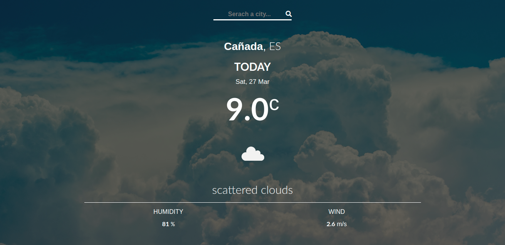

# Weather forecast app

> This repo contains an implementation of a weather forecast app using the open wethr api and sync functions.



## Built With

- javaScript,
- Html,
- css,
- boostrap,
- webpack
- open weather APi,

## Live Demo

[Live Demo Link](https://rawcdn.githack.com/Tresor11/weather-app/3a308bc41aa58345413db52a234e86f0d167855f/dist/index.html)


## Getting Started

To get a local copy up and running follow these simple example steps.

### Prerequisites
make sure you have node and npm istalled on you local computer
### clone the repo by typing
```git clone https://github.com/Tresor11/weather-app.git```
### Install
run 
```npm install```
to get the dependencies

```npm run build```
to get your main.js file updated

```cd dist```
to get the html file

open your local server and you should be good to go

## Authors

👤 **tresor**

- Github: [@Tresor11](https://github.com/Tresor11)
- Twitter: [@Tbireke](https://twitter.com/Tbireke)

## 🤝 Contributing

Contributions, issues and feature requests are welcome!

Feel free to check the [issues page](issues/).

## Show your support

Give a ⭐️ if you like this project!

## 📝 License

This project is [MIT](lic.url) licensed.
